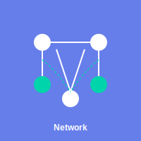

<p align="center">
  
</p>

<h1 align="center">simple_net</h1>

<p align="center">
  <a href="https://simple-eiffel.github.io/simple_net/">Documentation</a> •
  <a href="https://github.com/simple-eiffel/simple_net">GitHub</a>
</p>

<p align="center">
  
  
  
</p>

Production-ready TCP socket abstraction for Eiffel with intuitive API and full Design by Contract.

Part of the [Simple Eiffel](https://github.com/simple-eiffel) ecosystem.

## Status

✅ **Production Ready** — v1.1.0
- 132 tests passing, 100% pass rate
- Enhanced contract strength with frame conditions (49 new postconditions)
- Real SCOOP concurrency tests (12 separate object tests)
- TCP client/server sockets with intuitive API
- Void-safe and SCOOP-compatible

## Overview

**simple_net** is a production-ready TCP socket abstraction library for Eiffel that provides intuitive, Design-by-Contract-based APIs for building networked applications with client-server communication.

Unlike raw socket APIs that require extensive boilerplate, simple_net reduces typical TCP client/server implementations from 50-100 lines of code to just 5-10 lines, while maintaining full control and adding automatic error handling through contracts.

Part of the [Simple Eiffel](https://github.com/simple-eiffel) ecosystem.

## Quick Start (TCP Client)

```eiffel
local
    client: CLIENT_SOCKET
    address: ADDRESS
do
    -- Create and connect client
    create address.make ("example.com", 8080)
    client := create {SIMPLE_NET}.new_client_for_address (address)

    if client.connect then
        client.send_string ("Hello, server!")
        if attached client.receive_string as response then
            print (response)
        end
        client.close
    else
        print ("Connection failed: " + client.last_error.to_string)
    end
end
```

## Standard API (Full Control)

```eiffel
local
    lib: SIMPLE_NET
    client: CLIENT_SOCKET
do
    create lib.make
    client := lib.new_client_for_host_port ("example.com", 8080)

    if client.connect then
        -- Send/receive data
        client.close
    end
end
```

## Features

- **CLIENT_SOCKET** - Intuitive TCP client with connect, send, receive, close
- **SERVER_SOCKET** - TCP server with listen, accept, configurable backlog
- **ADDRESS** - Immutable network endpoint (host:port) with IPv4 validation
- **ERROR_TYPE** - Semantic error classification (connection refused, timeout, etc.)
- **SIMPLE_NET** - Facade providing convenient factory methods
- **Design by Contract** - Full preconditions, postconditions, invariants
- **SCOOP Compatible** - Thread-safe with proper separation semantics

## Installation

1. Set the ecosystem environment variable (one-time setup for all simple_* libraries):
```
SIMPLE_EIFFEL=D:\prod
```

2. Add to ECF:
```xml
<library name="simple_net" location="$SIMPLE_EIFFEL/simple_net/simple_net.ecf"/>
```

## Architecture

**simple_net** provides a clean layered architecture:

- **CLIENT_SOCKET** - TCP client implementation with connection lifecycle
- **SERVER_SOCKET** - TCP server implementation with accept loop
- **ADDRESS** - Network address (host:port) with validation
- **ERROR_TYPE** - Semantic error classification
- **SIMPLE_NET** - Facade for convenient factory creation

## Key Classes

| Class | Purpose |
|-------|---------|
| CLIENT_SOCKET | TCP client with connect, send, receive, close |
| SERVER_SOCKET | TCP server with listen, accept, backlog control |
| ADDRESS | Immutable host:port with IPv4 validation |
| ERROR_TYPE | Error classification (connection_refused, timeout, etc.) |
| SIMPLE_NET | Factory facade for convenient creation |

## Design Highlights

- **Zero Boilerplate** - Create and connect in 3 lines of code
- **Full Contracts** - Every feature has preconditions and postconditions
- **Error Handling** - Semantic error types instead of raw codes
- **SCOOP Ready** - Proper separation for concurrent programs
- **Void Safe** - Full null-safety guarantees

## License

MIT License - see [LICENSE](LICENSE) file.

---

Part of the [Simple Eiffel](https://github.com/simple-eiffel) ecosystem.
